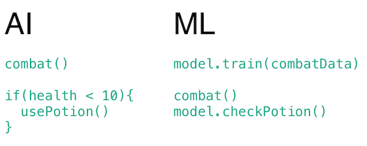
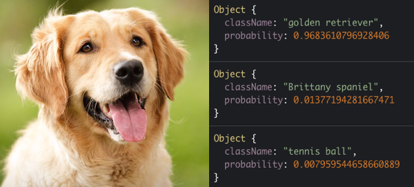

# Machine Learning

A reading list for Machine Learning tutorials, books and tools.

### What is Machine Learning?

Put simply, a Machine Learning project can learn from itself or from data that you provide. Instead of programming logic yourself, you will train a *model* and then let that model make decisions.

These models can often find patterns in complex data that even the smartest programmer could not have discovered. At the same time, training a model can have its own biases and preconceptions that you have to be aware of.

- Artificial Intelligence: you program a character to drink a potion once his health gets too low.
- Machine Learning: you train a model with previous combat data, and then let it decide what is the best moment to drink a health potion.

### Algorithms

A model is built using an *algorithm*. When starting a Machine Learning project, you have to look carefully at the data you have available, and the kind of result you need, so you can determine which algorithm fits that need.

*Using an algorithm to train a model to recognise cat drawings. This step is needed only once.*

*Once you have the model, you can ask if a new drawing resembles a cat. Or you could even let it imagine new cat drawings!*

**Real world example**

Imagine the cats being replaced by credit card transactions. You can train the model to recognise fraudulent transactions. Then, when a new transaction is happening, you can immediately test if this transaction is valid.

### Using Existing tools

You don't always need to understand all the math and logic behind Machine Learning to use it. This codepen tutorial will show you how to load tensorflow and a model to classify an image:

- [Classify an image with Tensorflow in 5 lines of code](https://codepen.io/eerk/pen/JmKQLw)

#### About this page

This page will focus on Javascript, and start with a tutorial using the **K-Nearest-Neighbour** algorithm. This tutorial will help you understand the basics of training and using a model. Then we will look at **Neural Networks** and start with building a Perceptron, to gain insight in the basic building block of a Neural Network.

- [More algorithms for Machine Learning](https://towardsdatascience.com/a-tour-of-the-top-10-algorithms-for-machine-learning-newbies-dde4edffae11)

# Javascript

Javascript allows us to use ML in web projects and quickly publish results.

### K-Nearest-Neighbour

This algorithm uses the distance between points to classify a new point. The KNN algorithm is useful to understand the basics of training a model and classifying data, without a complex algorithm:

- [Using the 'k-nearest neighbour' algorithm to train a model](https://github.com/NathanEpstein/KNear)
- [Demo project using 'K-Nearest-Neighbour'](https://github.com/KokoDoko/webcam-detectotron)

### Neural Networks in Javascript

A Neural Network is an algorithm that is inspired by the human brain. Data will flow through neurons in the network and is able to keep improving itself with each pass through the network.

- [But what *is* a neural network? - youtube](http://www.youtube.com/playlist?list=PLZHQObOWTQDNU6R1_67000Dx_ZCJB-3pi)
- [Neural networks demystified](http://lumiverse.io/series/neural-networks-demystified)

#### Perceptron

A perceptron is a Neural Network that has only one cell. You can code it by hand in just a few lines of code. This will help you to understand how one Neural Network cell calculates weights.

- [Coding a perceptron in Javascript, by Mathias P Johansson](https://youtu.be/o98qlvrcqiU), and the [result](https://beta.observablehq.com/@mpj/neural-network-from-scratch-part-1)

#### Brain JS

[BrainJS](https://github.com/BrainJS/brain.js) is a library that allows you to instantiate a Neural Network, train it and run a classification in just a few lines of code.

- [How to create a Neural Net in the browser with BrainJS](https://scrimba.com/c/c36zkcb)
- [Source code and examples for BrainJS](https://github.com/BrainJS/brain.js)

#### Tensorflow JS

The Javascript version of Google TensorFlow.

- [Tensorflow for Javascript](https://js.tensorflow.org)
- [Hello World in Tensorflow.JS](https://dev.to/notwaldorf/hello-tensorflow-2lc5)

#### Synaptic JS

Synaptic is another Neural Network Library for Javascript

- [Synaptic JS Neural Networks](http://caza.la/synaptic/)
- [Tutorial for Synaptic JS](https://medium.freecodecamp.org/how-to-create-a-neural-network-in-javascript-in-only-30-lines-of-code-343dafc50d49)

### ML5

ML5 makes TensorFlowJS a bit more accessible by supplying readymade examples with clear documentation for the most common Machine Learning projects, such as image classification, pose recogition, and text generation.

- [Simplify working with TensorflowJS using the ML5 library](https://ml5js.org)

### Magenta JS

- [Magenta](https://magenta.tensorflow.org/get-started/#magenta-js) is a google library that uses tensorflow to generate [images](https://tensorflow.github.io/magenta-js/image/index.html), [music](https://tensorflow.github.io/magenta-js/music/index.html) and [sketches](https://tensorflow.github.io/magenta-js/sketch/). 
- [Tutorial on drawing snowflakes with a Neural Network and Magenta](https://youtu.be/pdaNttb7Mr8)

# Python

[Python](https://www.python.org) is used by data scientists and in most Machine Learning courses online.

- [Udacity Intro to Machine Learning with Python](https://www.udacity.com/course/intro-to-machine-learning--ud120)
- [Building a perceptron from scratch](https://medium.com/@ismailghallou/build-your-perceptron-neural-net-from-scratch-e12b7be9d1ef) and [source code](https://github.com/smakosh/Perceptron-neural-net-from-scratch)

### Science Kit Learn

Science Kit Learn provides Python libraries, readymade datasets and algorithms for testing, and a visualisation tool. Get started running python with this tutorial:

- [SKLearn](http://scikit-learn.org/stable/)
- [Introduction to machine learning with scikit-learn](http://scikit-learn.org/stable/tutorial/basic/tutorial.html#machine-learning-the-problem-setting)

### Tensorflow

Tensorflow is Google's Machine Learning API for Python

- [Google Tensorflow tutorials](https://www.tensorflow.org/tutorials/)
- [Getting Started with TensorFlow](https://www.tensorflow.org/get_started/get_started)
- [Introduction to Deep Learning and Tensorflow](https://pythonprogramming.net/tensorflow-introduction-machine-learning-tutorial/)

# Processing

Processing is used in the creative field for creating music and visuals. 

- [Build a perceptron in Processing](https://www.youtube.com/watch?v=ntKn5TPHHAk).
- [Wekinator is a GUI for applying Machine Learning to webcam, audio and other sensor data](http://www.wekinator.org)
- [Wekinator workshop by Kars Alfrink](https://github.com/karsalfrink/useless-butler)

# Machine Learning Disciplines

### Image recognition

- [YOLO - you only look once](https://pjreddie.com/darknet/yolo/) Image recognition network, watch the cool [intro movie!](https://www.youtube.com/watch?v=MPU2HistivI)
- [Vize.ai Recognize and automate your images](https://vize.ai)
- [Clarifai image and video recognition tool](https://clarifai.com/developer/)
- [TensorFlow image recognition](https://www.tensorflow.org/tutorials/image_recognition)
- [ImageNet - training data for image recognition](http://www.image-net.org)

### Natural Language Processing

Understanding the meaning of written text

- [What are word vectors?](https://gist.github.com/aparrish/2f562e3737544cf29aaf1af30362f469)
- [Understanding Word2Vec Video by Daniel Shiffman](https://youtu.be/MOo9iJ8RYWM)
- [Natural Language Processing with Spacy.io](https://spacy.io)

### Speech Recognition

Converting spoken audio into text

- [Mozilla Deep Speech - blog post](https://blog.mozilla.org/blog/2017/11/29/announcing-the-initial-release-of-mozillas-open-source-speech-recognition-model-and-voice-dataset/) and [code](https://github.com/mozilla/DeepSpeech)
- [Google TacoTron Self-learning Speech Synthesizer](https://github.com/keithito/tacotron)
- [Pocket Sphynx Speech Recognition](https://github.com/cmusphinx/pocketsphinx)

### Paid services

- [Microsoft Machine Learning APIs](https://gallery.azure.ai/machineLearningAPIs)
- [Apple Core ML framework](https://developer.apple.com/documentation/coreml)
- [Machine Learning on Amazon Web Services](https://aws.amazon.com/machine-learning/)
- [Amazon Machine Learning Free Course](https://aws.amazon.com/training/learning-paths/machine-learning/)

# Reading list

- [The Mostly Complete Chart of Neural Networks](https://towardsdatascience.com/the-mostly-complete-chart-of-neural-networks-explained-3fb6f2367464)
- [Machine Learning for Humans](https://medium.com/machine-learning-for-humans/why-machine-learning-matters-6164faf1df12)
- [Machine Learning for designers](http://www.oreilly.com/design/free/machine-learning-for-designers.csp)
- [A visual introduction to Machine Learning](http://www.r2d3.us/visual-intro-to-machine-learning-part-1/)
- [Deep learning book](http://www.deeplearningbook.org)
- [Build more intelligent apps with machine learning](https://developer.apple.com/machine-learning/)(Apple)
- [Researching the use of ML in creative applications](http://blog.otoro.net)
- [Design in the era of the algorithm](https://bigmedium.com/speaking/design-in-the-era-of-the-algorithm.html)
- [Human-Centered Machine Learning](https://medium.com/google-design/human-centered-machine-learning-a770d10562cd)
- [The UX of AI (Google Design)](https://design.google/library/ux-ai/)
- [Linear algebra - the math behind ML algorithms](http://www.mathscoop.com/calculus/derivatives/derivative-by-definition.php)
- [Maths for Programmers](https://www.freecodecamp.org/news/beaucarnes/maths-for-programmers--09iy8H6lC)
- [Paul G Allen Course on Machine Learning algorithms](https://www.youtube.com/user/UWCSE/playlists?shelf_id=16&sort=dd&view=50)
- [Mastering Machine Learning with MatLab for Python](https://nl.mathworks.com/campaigns/offers/mastering-machine-learning-with-matlab.html?s_eid=PSB_17921)
- [Deep Learning Simplified - Youtube series](https://www.youtube.com/playlist?list=PLjJh1vlSEYgvGod9wWiydumYl8hOXixNu)
- [Neural Networks and Deep Learning is a free online book by Michael Nielsen that has been recommended by the guys from Tensorflow](http://neuralnetworksanddeeplearning.com)

# Community

- [AI Stackoverflow](https://ai.stackexchange.com)
- [Kaggle - Machine Learning challenges](https://www.kaggle.com)

# Demos and projects

- [Teleport Vision - generates HTML from pen and paper sketches](https://github.com/teleporthq/teleport-vision-api)
- [Training a model in Unity using a neural network](https://github.com/ArztSamuel/Applying_EANNs)
- [Neural Drum Machine](https://codepen.io/teropa/pen/JLjXGK) and [Voice-based beatbox](https://codepen.io/naotokui/pen/NBzJMW) created with [MagentaJS](https://magenta.tensorflow.org)
- [Demo for creating a self-learning Flappy Bird in Javascript](https://github.com/ssusnic/Machine-Learning-Flappy-Bird)
- [Algorithm notes](http://books.goalkicker.com/AlgorithmsBook/)
- [Google AI experiments](https://experiments.withgoogle.com/ai)
- [Quick Draw! - Can a Neural Network detect a doodle?](https://quickdraw.withgoogle.com)
- [Pyro - Uber's AI programming language](http://pyro.ai)
- [Runway - An app that adds ML to creative projects](https://runwayapp.ai)
- [Pixling - Building a life simulation app with Neural Networks](http://wiki.pixling.world/index.php/Main_Page)
- [Building a self-driving Mario Kart using TensorFlow](https://www.youtube.com/watch?v=Ipi40cb_RsI) and [documentation](https://www.youtube.com/redirect?q=https%3A%2F%2Fdocs.google.com%2Fdocument%2Fd%2F1p4ZOtziLmhf0jPbZTTaFxSKdYqE91dYcTNqTVdd6es4%2Fedit%3Fusp%3Dsharing&event=video_description&v=Ipi40cb_RsI&redir_token=Ybzxsbpmjb-vKOmpvcRlyEses5V8MTUxMzMzODkwNUAxNTEzMjUyNTA1)

## The future

[https://xkcd.com/1925/](https://xkcd.com/1925/)
